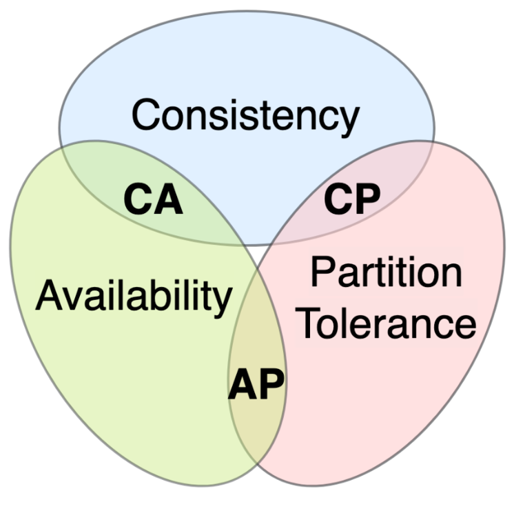
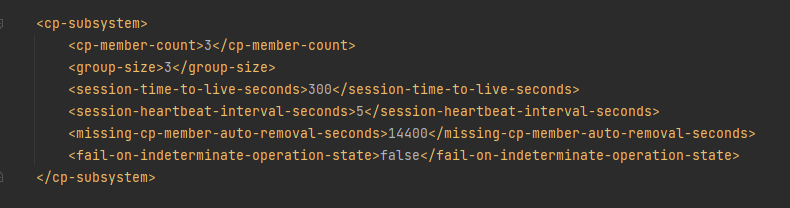

# CAP demo lab

##CAP introduction:
CAP theory, also known as the CAP theorem or Brewer's theorem, is a fundamental concept in
distributed computing that was formulated by computer scientist Eric Brewer in 2000.
It states that in a distributed system, you can achieve at most two out of three desirable
properties: Consistency, Availability, and Partition tolerance. Consistency refers to all
nodes in the system having the same data at the same time, Availability means that every
request to the system gets a response (not necessarily the most up-to-date), and Partition
tolerance ensures the system continues to operate despite network partitions or failures.
The CAP theorem helps system designers make trade-offs in distributed systems to meet their
specific requirements and constraints.



##Hazelcast:
Hazelcast is realtime data platform. It provides data structures that enable the construction
of distributed systems, ensuring AP or CP guarantees from the CAP theory. 
(CA is not considered as hazelcast focuses on distributed systems, where partition tolerance is crucial)


GitHub: https://github.com/hazelcast/hazelcast

Documentation: https://docs.hazelcast.com/hazelcast/5.3/


##Exercises:

### CPSubsystem:
CPSubsystem is a part of Hazelcast that enables user to create a CP cluster with datastructures 
following this guarantee. 

In CPSubsystem Hazelcast uses Raft algorithm to reach consensus between nodes in cluster. Subsystem 
is described and modified by several variables which change the behaviour of the cluster. The most important are:


- cp-member-count - describes total number of nodes in cluster
- group-size - describes the number of nodes participating in reaching consensus over state of the cluster.
  An odd number of CP members in a group is more advantageous to an even number because of the quorum or majority calculations.

For a CP group of N members:

- the majority of members is calculated as (N + 1) / 2.

- the number of failing members you wish to tolerate is calculated as (N - 1) / 2.

For example, in a CP group of five CP members, operations are committed when they are replicated
to at least three CP members. This CP group can tolerate the failure of two CP members and remain available.

Configuration used in exercise 1:


More info about CPSubsytem: https://docs.hazelcast.com/hazelcast/5.3/cp-subsystem/cp-subsystem


####Exercise1:

#####Scenario:

First and second exercise are focused on CP guarantee. It creates cluster with 3 nodes
which are in single group at start. The goal of the task is to find out how cluster behaves
when a network partitioning occurs. The partitioning is simulated with ``hazelcast.test``  package.
It exposes a new way to create hazelcast instances with firewalling capabilities. 
To isolate nodes from each other we use function SplitBrainTestSupport.blockCommunicationBetween()
which applies firewall between them.

In this exercise we want to isolate 1 node from others as it is shown on the diagram below.


Steps:

- Start the example in Ex1 package
- using the command prompt  with provided functions to perform the steps below
- get the value of the atomic variable (it should return 0)
- increase value of atomic variable on one node and check if other nodes see change
- partition network 
- check if you can retrieve the variable from isolated node
- check if you can retrieve the variable from other nodes
- try to increase value of atomic variable from both sides of network partition (what happens?)
- heal the network partition 
- check what happened with atomic variable afterwards.

TODO - consider asking students for explanation.


Build:
```
mvn clean compile
```

Run:
```
mvn exec:java
```
