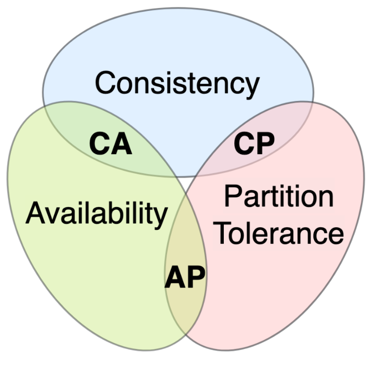
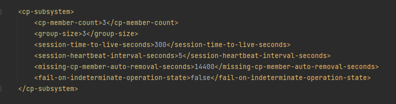
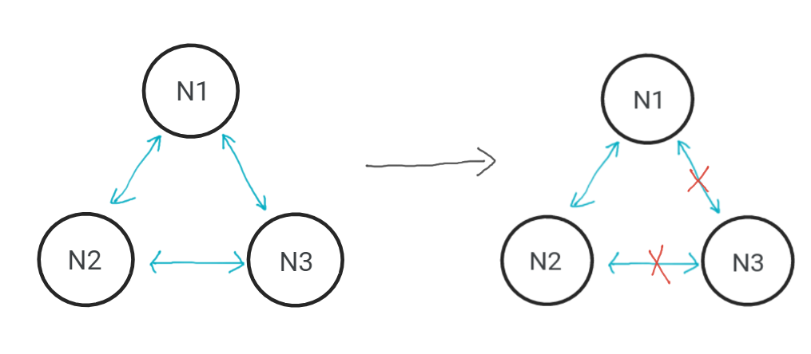
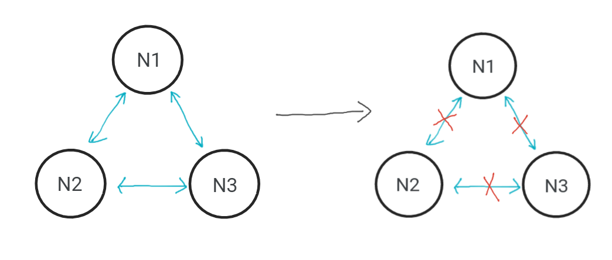

# CAP demo lab

## CAP introduction:
CAP theory, also known as the CAP theorem or Brewer's theorem, is a fundamental concept in
distributed computing that was formulated by computer scientist Eric Brewer in 2000.
It states that in a distributed system, you can achieve at most two out of three desirable
properties: Consistency, Availability, and Partition tolerance. Consistency refers to all
nodes in the system having the same data at the same time, Availability means that every
request to the system gets a response (not necessarily the most up-to-date), and Partition
tolerance ensures the system continues to operate despite network partitions or failures.
The CAP theorem helps system designers make trade-offs in distributed systems to meet their
specific requirements and constraints.



## Hazelcast:
Hazelcast is realtime data platform. It provides data structures that enable the construction
of distributed systems, [ensuring AP or CP guarantees](https://docs.hazelcast.com/hazelcast/5.3/architecture/architecture#apcp) from the CAP theory. 
(CA is not considered as hazelcast focuses on distributed systems, where partition tolerance is crucial)


GitHub: https://github.com/hazelcast/hazelcast

Documentation: https://docs.hazelcast.com/hazelcast/5.3/


## Exercises:

### CPSubsystem:
CPSubsystem is a part of Hazelcast that enables user to create a CP cluster with datastructures 
following this guarantee. 

In CPSubsystem Hazelcast uses Raft algorithm to reach consensus between nodes in cluster. Subsystem 
is described and modified by several variables which change the behaviour of the cluster. The most important are:


- cp-member-count - describes total number of nodes in cluster
- group-size - describes the number of nodes participating in reaching consensus over state of the cluster.
  An odd number of CP members in a group is more advantageous to an even number because of the quorum or majority calculations.

For a CP group of N members:

- the majority of members is calculated as (N + 1) / 2.

- the number of failing members you wish to tolerate is calculated as (N - 1) / 2.

For example, in a CP group of five CP members, operations are committed when they are replicated
to at least three CP members. This CP group can tolerate the failure of two CP members and remain available.

Configuration used in exercise 1:



More info about CPSubsytem: https://docs.hazelcast.com/hazelcast/5.3/cp-subsystem/cp-subsystem

### Scenario:
All exercises create cluster with 3 nodes. The goal of the task is to find out how cluster behaves
when a network partitioning occurs. The partitioning is simulated with ``hazelcast.test``  package.
It exposes a new way to create hazelcast instances with firewalling capabilities.
To isolate nodes from each other we use function SplitBrainTestSupport.blockCommunicationBetween()
which applies firewall between them.

### How to run:
1. Install maven
2. Run `mvn exec:java@ex1`, `mvn exec:java@ex2` or `mvn exec:java@ex3` depending on the exercise

### Viewing logs

Hazelcast supports logging of operations  currently performed in the cluster. We dacided
to put logs into log/hazelcast.log file to make the command prompt more readable.
(configuration of logging is accessible in resources/log4j2.properties file) 

To view the logs in real time you can use linux command:

```
less log/hazelcast.log
``` 

And then pres shift+f to set auto refresh.


### Exercise 1:

First and second exercise are focused on CP guarantee. In these cases all 3 nodes are in single group of a CPSubsystem.
In order to demonstrate behaviour of the cluster we will use variable of type: ``AtomicLong`` from the CPSubsytem.

https://docs.hazelcast.com/hazelcast/5.3/data-structures/iatomiclong

In this exercise we want to isolate 1 node from others as it is shown on the diagram below.




Steps:

- Start the example in Ex1 package
- use the command prompt with provided functions to perform the steps below
- get the value of the ``AtomicLong`` (it should return 0)
- increase value of ``AtomicLong`` on one node and check if other nodes see the change
- partition network 
- check if you can retrieve the variable from isolated node
- check if you can retrieve the variable from other nodes
- try to increase value of ``AtomicLong`` from both sides of network partition (what happens?)
- heal the network partition 
- check what happened with ``AtomicLong`` afterwards

#### Question:
Explain if and why you were (not) able to get/increase value of ``AtomicLong`` in each step on particular nodes.


### Exercise 2:

This exercise is similar to exercise1. The only difference is that we isolate each node which
causes lack of communication in the cluster.



Steps:

- Start the example in Ex2 package
- use the command prompt with provided functions to perform the steps below
- get the value of the ``AtomicLong`` on different nodes (it should return 0)
- increase value of ``AtomicLong`` on one node and check if other nodes see the change
- partition network
- check if you can retrieve the variable or increase its value from any isolated node
- heal the network partition (in this case healing partition can take some time due to 
problems with achieving nodes agreement)
- check what happened with ``AtomicLong`` afterwards

#### Question:
Explain if and why you were (not) able to get/increase value of ``AtomicLong`` in each step on particular nodes.

### Exercise 3:

This exercise are focused on AP guarantee. To demonstrate behaviour of the cluster we will use variable of type:
``PNCounter`` from the Hazelcast instance. ``PNCounter`` sacrifices consistency in favour of availability.

https://docs.hazelcast.com/hazelcast/5.3/data-structures/pn-counter

We will use same partitioning as in exercise 1 (isolating only one node) 
but we will not create any CPSubsystem nor node group.


Steps:

- Start the example in Ex3 package
- use the command prompt with provided functions to perform the steps below
- get the value of the ``PNCounter`` (it should return 0)
- increase value of ``PNCounter`` on one node and check if other nodes see the change
- partition network
- check if you can retrieve the variable from isolated node
- check if you can retrieve the variable from other nodes
- try to increase value of ``PNCounter`` from both sides of network partition (what happens?)
- heal the network partition
- check what happened with ``PNCounter`` afterwards

#### Question:
Explain if and why you were (not) able to get/increase value of ``PNCounter`` in each step on particular nodes.


